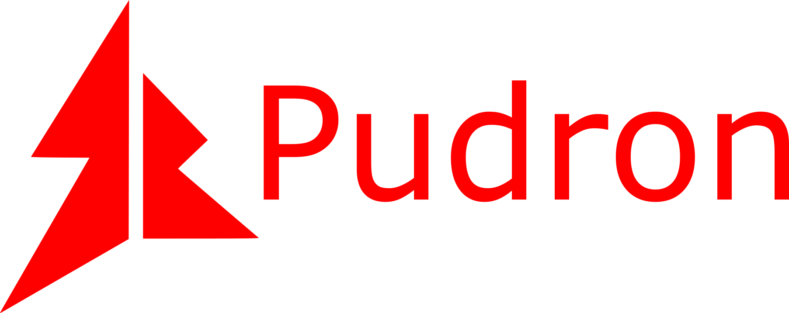

# Pudron
## 一门易用、轻巧、扩展性强、潜力巨大的解释型编程语言
其极力简化编程，让人打起代码来更省力，把更多的精力集中在实现上。
## 主要特点
* 代码格式简洁、美观、人性化
* 支持多种编程方法，如面向对象、面向过程等
* 可拓展性强，使用动态链接库来拓展Pudron库
* 潜力巨大
## 编译
在命令行中输入 `make`
build目录中的pudron即为编译结果  
注意：在linux上编译时，加上参数 `PLATFORM=LINUX`
## 用法
在命令行打开pd来打印参数使用方法  
教程和文档在我的项目PudronDocs中,欢迎大家clone。
## 开发缘由
在我学习编程时，我发现许多编程语言的入门门槛很高，一开始就要接触对初学者来说很高大上的概念，
而且语言格式有点难懂。在开发时实现一个简单的功能却要打大量繁琐的代码，所以我开发这门编程语言来尽量降低入门门槛，
让编程更轻松。
## 文档
Pudron文档见[这里](https://pudron.gitee.io/pudrondocs)。
## 关于作者
我的故事也写在文档里,欢迎大家阅读。