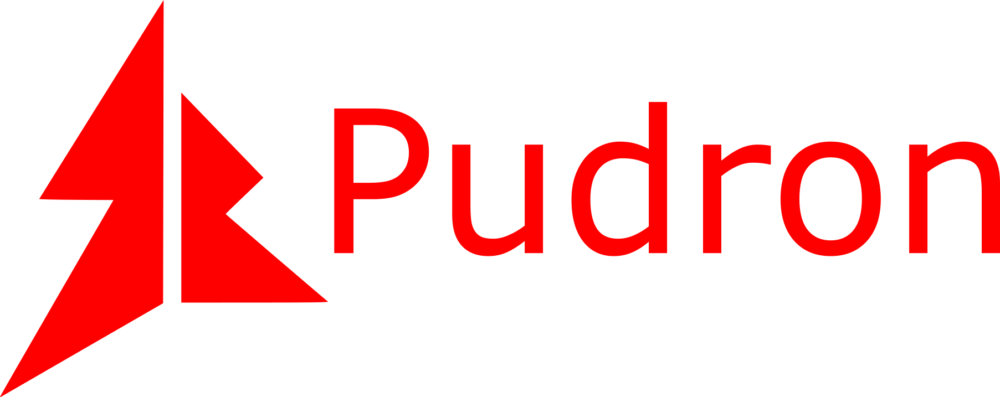

# Pudron
[中文版本](README.md)
## An easy-to-use, lightweight, extensible and high potential interpretative programming language
It tries the best to simplify the computer programming,make people easy to code and focus on the realization.
## Main Features
* The format of code is pithy,wonderful and humanized
* Support many programming methods,such as object-oriented and Process-oriented
* Extensible,using dynamic link library to expand the Pudron library
* High potential
## Download
Choose the package you want in [Release]().
## Usage
`pd [arguments] [Pudron code file]`
### Arguments
* -v:view version
* -m [library name]:output the Pudron library file
execute `pd` in the command line to find out more
## Reasons for development
When I was learning computer programming,I found many programming languages have a high threshold.There many big concepts for beginners.
And their format is a little hard to understand.When developing a simple function, a lot of tedious code is needed.So I developed this programming language to minimize the entry threshold
and make programming easier.
## Document
I write a concise document for you.See [here](https://pudron.github.io/Pudron/).
## About Author
My stroy is also in the document.Welcome to read it.
## License
Copyright (c) Pudron. All rights reserved.  
Licensed under the [GPLv3](LICENSE) license.